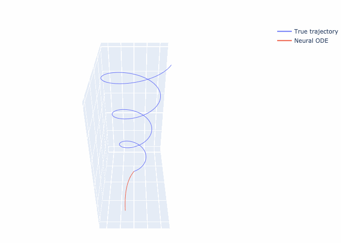

# Stochastic calculus: SDEs, diffusion, flow matching 

Implementations of stochastic calculus methods used at GenAI, like diffusion and flow-based models.
In addition to some experiments, the repository contains lab solutions for MIT 6.S184 <a href="https://diffusion.csail.mit.edu/">course</a>. 

-----

Neural ODE training process:

| Lab Name              | Source                                                                                                                                                  |
|-----------------------|---------------------------------------------------------------------------------------------------------------------------------------------------------|
| ODE recap. Neural ODE |                                       |
| Working with SDEs     |  |

